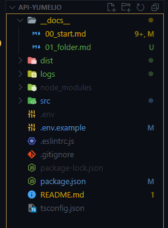

# Folder structure

The main folder where you will create you TS files is `src`.

You can find :

- `__docs__` where all the documentation will be written
- `data` where all migrations will be done
- `dist` where all TS files are compiled into Javascript
- `logs` retracing errors
- `src` where all TS files will be

## Find our folder structure below

 
 

---

[Previous](./00_start.md) | [Home](../README.md) | [Next](./02_project.md)
