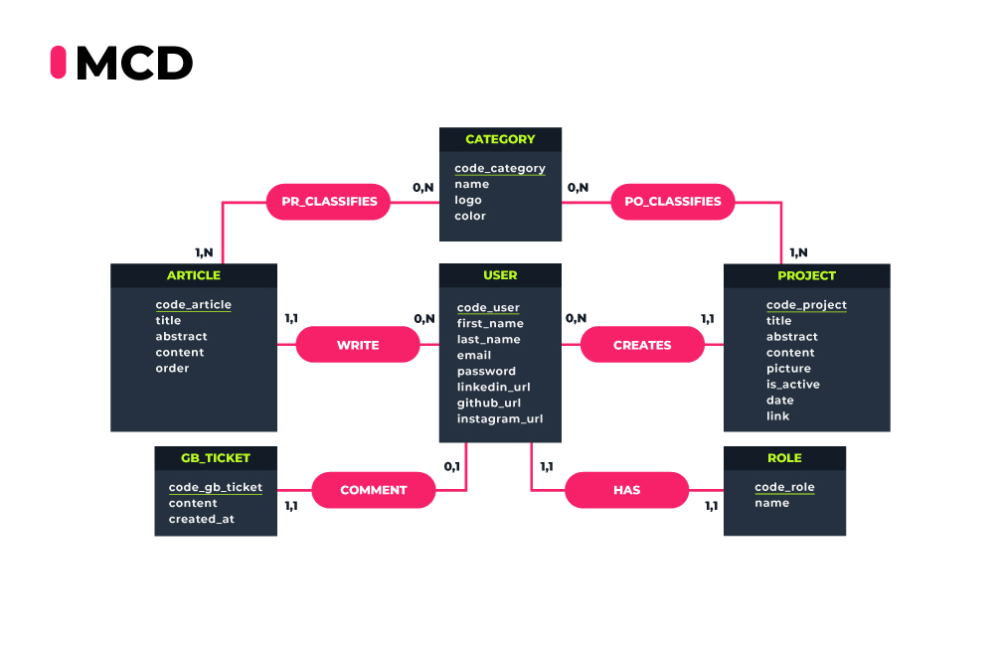

# Conceptual Data Model (CDM)

High-level conceptual data models provide concepts for presenting data in ways that are close to the way people perceive data.

A relationship represents an association among entities : for example, a user can own many articles.

A relationship exists between the user and each article.

# General Purpose Modeling (or Logical Data Model / GPM or LDM)

Record-based logical data models provide concepts users can understand but are not too far from the way data is stored in the computer.
Three well-known data models of this type are relational data models, network data models and hierarchical data models.

We will use here the relationnal model that represents data as relations, or tables.

# Physical Data Model (PDM)

A physical data model is a database-specific model that represents relational data objects (for example, tables, columns, primary and foreign keys) and their relationships.

A physical data model can be used to generate DDL statements which can then be deployed to a database server.

Using the workbench, you can create a physical data model in several ways:

- Create a blank physical model by using a wizard
- Create a physical model from a template by using a wizard
- Reverse engineer a physical model from a database or a DDL file by using a wizard or by dragging data objects from the Data Source Explorer
- Import a physical data model file from the file system
- Create a physical model by transforming from a logical data model

For PDM, we use the ERD Tool from pgAdmin4

[Previous](./03_usecase.md) | [Home](../README.md) | [Next](./05_endpoints.md)
