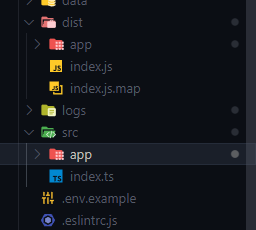

# Entrypoint

The entrypoint here is the file where your server will start.

It's commonly called `index.js`, `server.js` or `app.js`. Whatever the name, it's THE point.

For this API, we use Typescript. Everything was coded in `index.ts` file and thanks to the compiler, we find our `index.js` in the dist folder.



## Structure

To configure the server and to launch the application, you have to :

- import dotenv for configure environment variables
- import express framework for the API
- import routes to define each URL, return a 404 page if it's not found
- import debug for log any error and debugging
- import Swagger for API documentation
- import helmet for data and identity security
- Set the header to configure the [CORS](https://developer.mozilla.org/fr/docs/Web/HTTP/CORS) to share the resources

```js
//~ Dotenv
import 'dotenv/config';

//~ Import Express
import express, { Request, Response } from 'express';
const app = express();
//& export for test JEST
export { app };

//~ Import module
import { router } from './app/routes/index.js';
import { ErrorApi } from './app/services/errorHandler.js';

//~ Protect API Helmet
import helmet from 'helmet';
app.use(helmet());

//~ Import Debug
import debug from 'debug';
const logger = debug('EntryPoint');

//~ IMPORTATION SWAGGER DOCS
import { specs, serve, setup, cssOptions } from './app/swaggerDocs/swaggerDocs.js';
app.use('/api-docs', serve, setup(specs, cssOptions));

//~ Encoding parsing the body
//accept Content-type: application/json
app.use(express.json());
// accept Content-type: application/x-www-form-urlencoded
app.use(
  express.urlencoded({
    extended: false
  })
);

//~ Cors
app.use((req: Request, res: Response, next) => {
  res.setHeader('Access-Control-Allow-Origin', '*');
  res.setHeader('Access-Control-Allow-Headers', 'Content-Type, Authorization');
  res.setHeader('Access-Control-Allow-Methods', 'GET,HEAD,OPTIONS,POST,PUT,PATCH,DELETE');

  // res.setHeader('Access-Control-Allow-Headers', 'Access-Control-Allow-Headers, Origin,Accept, X-Requested-With, Content-Type, Access-Control-Request-Method, Access-Control-Request-Headers');

  next();
});

//If you have your node.js behind a proxy and are using secure: true, you need to set 'trust proxy' in express
app.set('trust proxy', 1);
// trust first proxy if deploy

//~ Session
import session from 'express-session';
app.use(
  session({
    saveUninitialized: true, //Forces a session that is “uninitialized” to be saved to the store. A session is uninitialized when it is new but not modified
    resave: true, //Forces the session to be saved back to the session store, even if the session was never modified during the request
    proxy: true, //Trust the reverse proxy when setting secure cookies (via the “X-Forwarded-Proto” header).
    //The default value is undefined.
    secret: process.env.SESSION_SECRET!, //required to sign the session ID cookie
    cookie: {
      httpOnly: true, // Be careful when setting this to true, as compliant clients will not allow client-side JavaScript to see the cookie in document.cookie
      secure: true, //will not send the cookie back to the server in the future if the browser does not have an HTTPS connection
      sameSite: 'lax', // or 'strict' - The "SameSite" attribute limits the scope of the cookie
      maxAge: 24 * 60 * 60 * 1000 //24 hours
      //expires : new Date(Date.now() + 60 * 60 * 1000) //1 hour
    }
  })
);

//~ Router
app.use(router);

//~ Error 404 NOT Found
app.use((req, res) => {
  throw new ErrorApi(`Page not found !`, req, res, 404);
});

//~ Launch Server
if (process.env.NODE_ENV !== 'test') {
  const PORT = process.env.PORT ?? 3000;

  app.listen(PORT, () => {
    logger(`🚀\x1b[1;35m Launch server on http://localhost:${PORT}\x1b[0m`);
  });
}

```

---

[Previous](./05_endpoints.md) | [Home](../README.md) | [Next](./07_structure.md)
