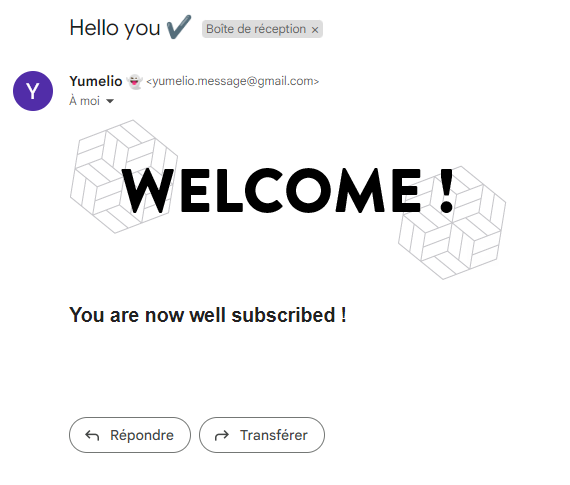

# Npm Nodemailer

[Official site - Nodemailer](https://nodemailer.com/about/)

Using the NPM module [Nodemailer](https://www.npmjs.com/package/nodemailer)

```
Nodemailer is a module for Node.js applications to allow easy as cake email sending. The project got started back in 2010 when there was no sane option to send email messages, today it is the solution most Node.js users turn to by default.
```

```
npm install nodemailer
```

## Example code
---
## File env

For nodemailer we have used environment variables to not directly display the email and its password

```
# MAILER
USER_MAILER=myexample@example.com
PASSWORD_MAILER=myPassword
```
---
## File nodemailerAuto.js

Creation of a js file dealing with the configuration necessary for the proper functioning of nodemailer, containing several parts

**Imports used**

```js
//~ Import Dotenv
import 'dotenv/config';

//~ Import Debug
import debug from 'debug';
const logger = debug('NodeMailer');

//~ Import Nodemailer & dataMailer
import nodemailer from 'nodemailer';
import dataMailer from './dataMailer.json' assert { type: 'json' };
```

**SMTP TRANSPORT**

SMTP is also the protocol used between different email hosts, so its truly universal. Almost every email delivery provider supports SMTP based sending

```js
//~  SMTP TRANSPORT
//& Config transporter "Gmail"
let transporter = nodemailer.createTransport({
  host: 'smtp.gmail.com',
  auth: {
    user: process.env.USER_MAILER,
    pass: process.env.PASSWORD_MAILER,
  },
});
```

**Examples with different tranporter**

```js
//~ TRANSPORTER
//& Config transporter "Outlook/Hotmail"
let transporter = nodemailer.createTransport({
  host: 'smtp-mail.outlook.com',
  port: 535,
  secure: false,
  tls: {
    ciphers: 'SSLv3',
  },
  auth: {
    user: process.env.USER_MAILER,
    pass: process.env.PASSWORD_MAILER,
  },
});

//& Config transporter "Gmail"
let transporter = nodemailer.createTransport({
  host: 'smtp.gmail.com',
  port: 465,
  secure: true, // true for 465, false for other ports
  auth: {
    user: `${process.env.USER_MAILER}`, // generated ethereal user
    pass: `${process.env.PASSWORD_MAILER}`, // generated ethereal password
  },
});

//& Type 'OAuth2'
let transporter = nodemailer.createTransport({
  host: 'smtp.gmail.com',
  auth: {
    // type: 'OAuth2',
    user: process.env.USER_MAILER,
    pass: process.env.PASSWORD_MAILER,
    // clientId: process.env.OAUTH_CLIENTID,
    // clientSecret: process.env.OAUTH_CLIENT_SECRET,
    // refreshToken: process.env.OAUTH_REFRESH_TOKEN
  },
});
```

**Creation of email content**

```js
//~ EMAIL CONTENT
//& Config content email
const sendEmail = {
  toUser(email: string, context: any) {
    logger('Email sent to user:', email);
    logger('dataMailer: ', dataMailer[`${context}`].subject);
    return transporter.sendMail({
      from: `"Yumelio 👻" <'${process.env.USER_MAILER}'>`, // sender address
      to: `${email}`, // list of receivers
      subject: dataMailer[`${context}`].subject, // Subject line
      text: dataMailer[`${context}`].text, // plain text body
      html: dataMailer[`${context}`].html, // html body
    });
  },
};

export { sendEmail };
```
---
## File dataMailer.json

Creation of a json file to store and establish the different types of mails, here is a basic use :

```json
{
  "subscribe": {
    "subject": "Hello you ✔",
    "html": "<br> <h2>You are now well subscribed !</h2><br><p></p>"
  },

  "unsubscribe": {
    "subject": "Hello unsubscribe ✔",
    "html": "<b>Hello unsubscribe !</b>"
  },

  "example": {
    "from": "sender@server.com",
    "to": "receiver@sender.com",
    "subject": "Message title",
    "text": "Plaintext version of the message",
    "html": "<p>HTML version of the message</p>"
  }
}
```
---
## File userController.js

**Import**

```js
import { sendEmail } from '../services/nodemailerAuto.js';
```

**Function doSignUp**

```js
//~ Send an email to confirm creation
await sendEmail.toUser(email, 'subscribe');
```

**Function deleteUser**

```js
//~ Send an email to confirm delete user
await sendEmail.toUser(user.email, 'unsubscribe');
```

# Final render

When the user finishes the registration, he will receive this type of email



---

[Previous](./11_ajv.md) | [Home](../README.md) | [Next](./13_errors.md)
